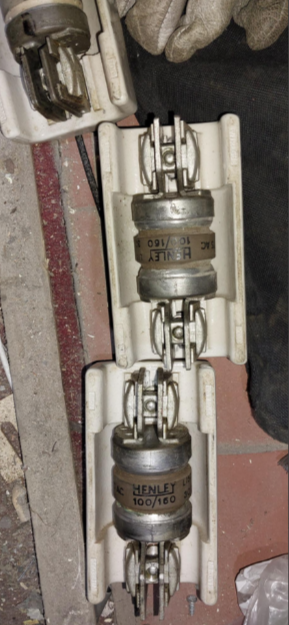
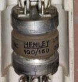

# UK Distribution Equipment Archive

A growing reference library of legacy electrical distribution equipment found across UK networks.

## Why This Archive Exists

Many items of equipment remain in service decades after manufacture, yet little information exists online to help engineers identify and understand them.

This archive aims to preserve knowledge of these assets through photographs, ratings, manufacturer information and field observations.

---

## Equipment Library

### [J&P Type ME 100/160A Dual-Rated HRC Fuse](jp-type-me-100-160a-dual-rated-fuse.html)

## Featured Equipment

### J&P Type ME 100/160A Dual-Rated HRC Fuse

**Why Dual-Rated?**

Designed to carry the lower continuous current rating while accommodating higher short-duration currents associated with equipment energisation and temporary demand peaks.

*Dedicated article and photographs coming soon.*
